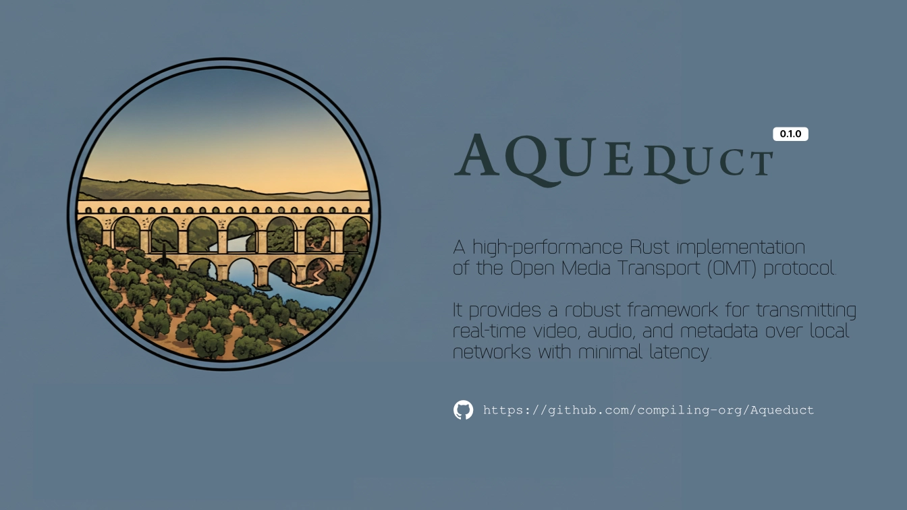

# Aqueduct

Aqueduct is a high-performance Rust implementation of the **Open Media Transport (OMT)** protocol. It provides a robust framework for transmitting real-time video, audio, and metadata over local networks with minimal latency.

Similar to NDI but open-source and built with Rust's safety and concurrency features, Aqueduct aims to be the standard for open IP video workflows.



## Key Features

*   **Zero-Copy Architecture**: Uses `bytes::BytesMut` and careful buffer management to minimize memory allocations. Frames are encoded directly into transmission buffers.
*   **Async Core**: Built on top of `tokio` for efficient, non-blocking network I/O.
*   **Service Discovery**: Automatic sender discovery using DNS-SD (mDNS), compatible with standard OMT tools.
*   **Multi-Stream**: Supports synchronized Video, Audio, and Metadata streams.
*   **Screen Capture**: Integrated screen capture (via `xcap`) for immediate desktop streaming.
*   **Cross-Platform**: Designed to run on Windows, Linux, and macOS.

## Architecture: How It Works

### 1. The Sender (`Sender`)
The sender is responsible for capturing content, encoding it, and making it available on the network.
*   **Capture**: Grabs frames from a source (e.g., Screen, Camera, Generated Content).
*   **Encoding**: Compresses raw frames using LZ4 (configurable to other codecs) to reduce bandwidth while maintaining low latency.
*   **Packetization**: Wraps compressed data into OMT-compliant binary packets with headers for Timestamp, Type, and Flags.
*   **Discovery**: Registers itself as a `_omt._tcp` service via mDNS so receivers can find it automatically.

### 2. The Receiver (`Receiver`)
The receiver discovers sources and consumes the stream.
*   **Discovery**: Browses for `_omt._tcp` services on the local network.
*   **Connection**: Establishes a TCP connection to the selected sender.
*   **Reassembly**: Reads the stream, handles packet boundaries, and extracts complete frames.
*   **Zero-Copy Decoding**: Decompresses frame data into reusable buffers to avoid memory churn.

### 3. The Protocol
Aqueduct uses a lightweight binary protocol over TCP:
*   **Header**: 4-byte Length + 4-byte Type.
*   **Payload**: The actual Video, Audio, or Metadata content.
*   **Metadata**: XML-based sidecar data for tally lights, source names, and custom events.

## Getting Started

### Prerequisites
*   **Rust**: Install via [rustup.rs](https://rustup.rs/).
*   **Toolchain**: On Windows, we recommend the GNU toolchain (MinGW) for broad compatibility, though MSVC works with proper setup.

### Running the Examples

**1. Start the Sender**
This will capture your primary monitor and stream it.
```bash
cargo run --example sender
```

**2. Start the Receiver**
In a separate terminal, this will discover the sender and open a preview window.
```bash
cargo run --example receiver
```
*Press `Esc` to close the preview window.*

## Usage as a Library

To use Aqueduct in your own application, add it to your `Cargo.toml` (once published, or via git):

```toml
[dependencies]
aqueduct = { git = "https://github.com/compiling-org/Aqueduct.git" }
```

### Creating a Sender
```rust
use aqueduct::{Sender, Packet, VideoFrame};

let sender = Sender::new(9000).await?;
// ... capture frame ...
sender.send(Packet::Video(frame))?;
```

### Creating a Receiver
```rust
use aqueduct::{Discovery, Receiver};

// Discover services
let discovery = Discovery::new()?;
discovery.browse_sources(|event| println!("Found: {:?}", event))?;

// Connect
let mut receiver = Receiver::connect("192.168.1.50:9000").await?;
while let Ok(packet) = receiver.receive().await {
    // handle packet
}
```

## Roadmap & Todo

We are actively working towards a stable 1.0 release.

- [ ] **Crate Publishing**: Clean up public API and publish to crates.io.
- [ ] **Codec Plugins**: Abstract codec interface to support NDI-like speed or H.264/HEVC.
- [ ] **Hardware Acceleration**: Integrate GPU encoding/decoding.
- [ ] **Resilience**: Add automatic reconnection and packet loss handling (FEC/Retransmission).
- [ ] **Audio Sync**: Precise audio/video synchronization using PTP or NTP timestamps.
- [ ] **Cross-Platform UI**: Improve the preview window to be a full featured reference player.

## License

MIT License. See `LICENSE` for details.
